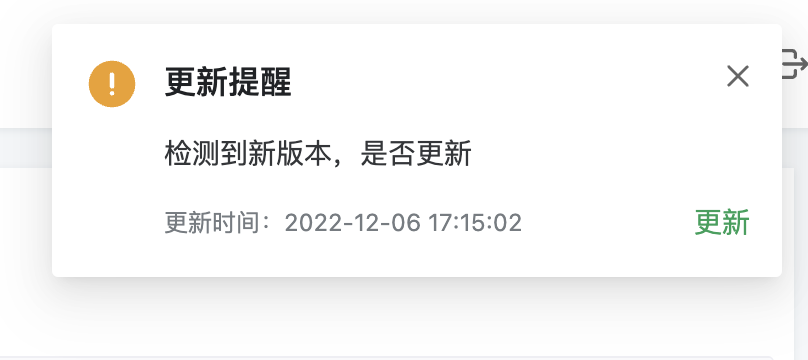

# webVersionCheck

## 前言

这是一个适用于前端版本检测能力的插件。

仅包含客户端检测程序，不包含构建时的插件，如vite、webpack等



## 使用

### 客户端

```bash
npm i  web-check-version -S

yarn add  web-check-version

pnpm add web-check-version
```

```js
import webVersionCheck from "web-check-version";

webVersionCheck({
  filePath: "version.json", // 需要请求的版本文件地址，默认是不需要更改的，如果部署的网址为域名的二级目录，请填写绝对路径。
  interval: 5 * 1000,
  key: "version", // 版本文件json中的version key
  // 检测到版本更新时的回调
  update(reload, { version }) {
    const confirm = window.confirm(`
    "发现新版本，是否刷新"
    "最新版本号为：", ${version}
    `);
    if (confirm) {
      reload?.();
    }
  },
  debug: false, //是否开启debug模式， debug模式下，update回调时机与实际相反。主要用于测试
});
```

### 需要配合构建工具来使用

**vite：**

推荐使用 `vite-plugin-generate-file`

```bash
pnpm add -D vite-plugin-generate-file
```

vite.config.js

```js
import { defineConfig } from "vite";
import generateFile from "vite-plugin-generate-file";
// https://vitejs.dev/config/
export default defineConfig({
    server: {
        port: 8000, //
    },
    plugins: [
        generateFile([
            // version.json 标识当前版本信息，用于页面更新提醒
            {
                type: "json",
                output: "version.json",
                data: {
                    version: Date.now(),
                },
            },
        ]),
    ],
});
```

**webpack：**

暂时没找到合适的插件，待补充
